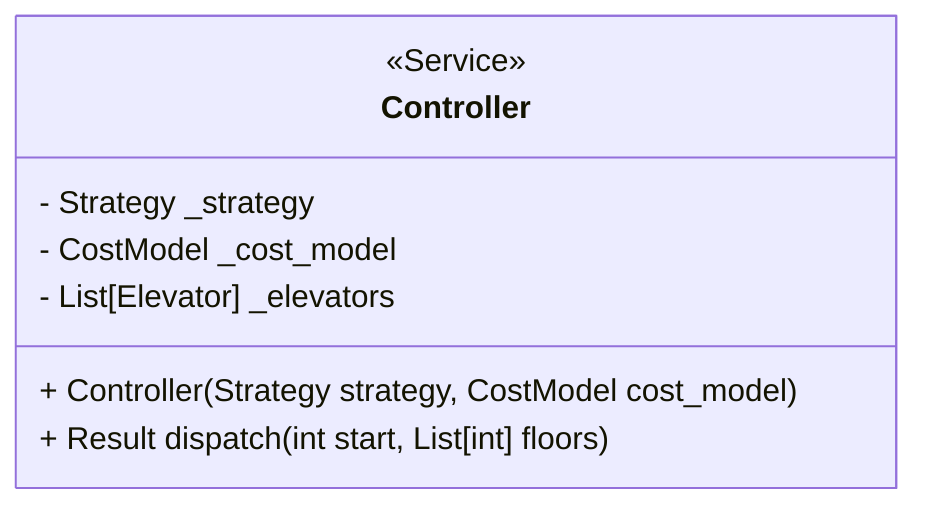
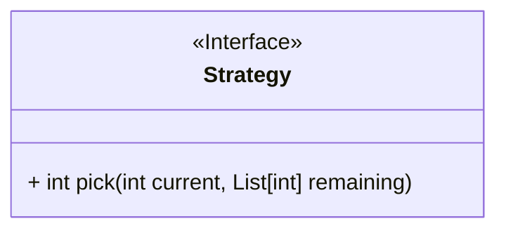
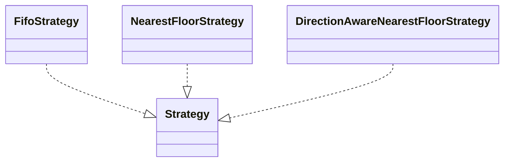
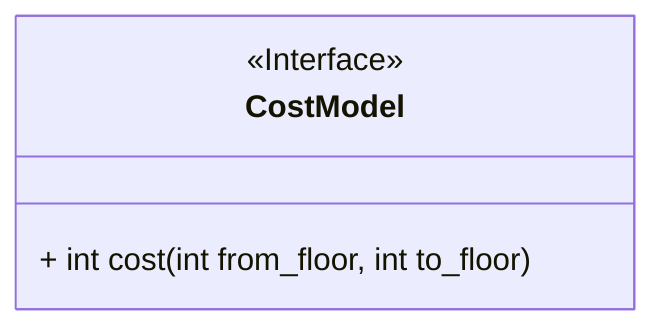
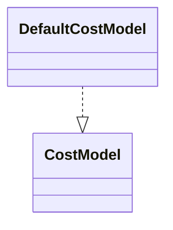
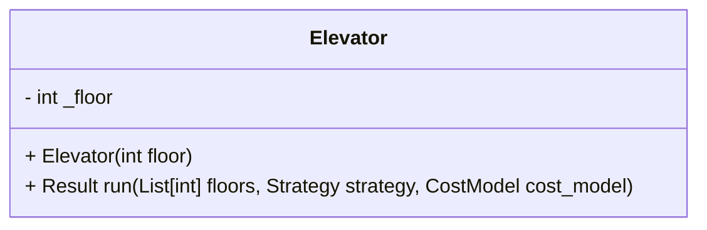
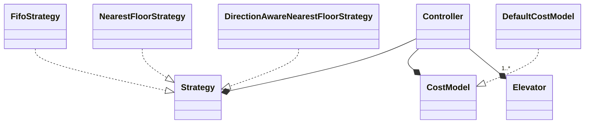

# Elevator System Design

Simple elevator system built to be fairly extendable under changing requirements.

## Requirements

Initial requirements:

```
- Inputs: [list of floors to visit] (e.g. elevator start=12 floor=2,9,1,32)
- Outputs: [total travel time, floors visited in order] (e.g. 560 12,2,9,1,32)
- Single floor travel time: 10
```

This is quite sparse so a lot of assumptions and expectations of adaptability needed to be added. Some assumptions:

1. System consists of only one elevator
2. Elevator can only travel vertically
3. Input/output example of FIFO dispatch strategy is intentional
4. All passengers enter at once and requests are given in a single batch
5. Since all passengers enter at once there is no interactivity or servicing new requests en route
6. Floor numbers less than or equal to zero are invalid but upper bound is not known
7. No handling of alpha-only or alpha-prefixed floors (e.g. `B1`, `PH`, etc.)
8. No stop costs (doors open/close time)
9. No time is calculated from elevator construction to starting on initial floor
10. Neighbor deduplication (i.e. `1, 2, 2, 2, 3` would be treated as `1, 2, 3`)
11. No expectation of error handling for invalid floor entries
12. Input floors array is sufficiently small enough to fit into memory without issue

Given this is being built in an interview context, I'm trying to strike a balance between creating something simple and efficient that meets the given requirements vs. building something that can be easily extended given expected questions that will be posed during the technical panel.

Extensions/modifications that system can be easily modified to handle:

1. More than one elevator (but all with same initial starting floor)
2. Additional dispatch strategies (nearest floor, direction-aware nearest floor, etc.)
3. Add stop and other potential costs
4. Priority servicing
5. Debugging/tracing or output format changes (keeping some track of state changes)

Extensions/modifications that may be requested but would require heavy changes to the system:

1. Request model changed to up/down source request with secondary floor destination selection
2. Interactivity with requests arrive while in motion
3. Restricted floors
4. Passenger quantity limits and/or weight capacity

## Design

Domain model:

- Controller
- Strategy
- Cost Model
- Elevator
- Result

### Controller

The controller uses a strategty pattern to easily allow changes to:

- Scheduling/ordering strategy
- Cost model for measurement logic

I could have avoided the controller layer and pushed down some of the config handling and other things to the elevator entity itself but with the expectation that the requirements aronud one and only one elevator changing this was a better option to anticipate that design.



### Strategy

Generally, in the real world a FIFO approach is not used for servicing elevator requests so I'm expecting this requirement to change from the initial requirements and input/output example to something closer to the real world like nearest floor or direction-aware nearest floor.

This would be an interface that would be passed in to the controller using a DIP-friendly design.

The CLI will default to FIFO strategy but I will add an option to select a different strategy. To stress the design, I'll implement strategies for FIFO, nearest floor, and direction-aware nearest floor.





### Cost Model

Right now the cost model is `abs(floor[i] - floor[i + 1])` with a constant single floor travel time of 10 seconds[^1] but I do expect to field questions around changes to the cost model such as adding open/close door times, etc. so I wanted to make this DIP-friendly as well.





[^1]: Just realized this is also an assumption of "seconds" since this isn't explicitly called out in the initial requirements

### Elevator

The elevator is designed in a way as to be unaware of the global service requests so that the controller can partitiion requests in whatever way it wants. This helps if extended to support multiple elevators.

The elevator receives the cost model and strategy from the controller and does not hold any of that state or logic. This makes the design simple and again, allows more flexibility for changing requirements without being overly complicated.



### Full Overview



## Testing

For testing, I've added:

- linting
- static type checking
- unit tests
- integration tests
- end-to-end tests

You can run all with:

```sh
chmod +x -R scripts
./scripts/ci_pipeline.sh
```

I created this script as a bare bones example of a potential CI pipeline that could be stood up in front of merges to trunk.

All pytest runs include code coverage calculations with a high passing threshold of 100%.

## Usage

I've added a Dockerfile to containerize this application to avoid issues with dependencies and portability as well as to make it closer to a real-world application. To run the app:

```sh
docker build . -t elevator --target app -q > /dev/null
docker run --rm elevator 12 2,9,1,32
```

To explore the full CLI API you can run:

```sh
docker run --rm elevator:latest --help
```
